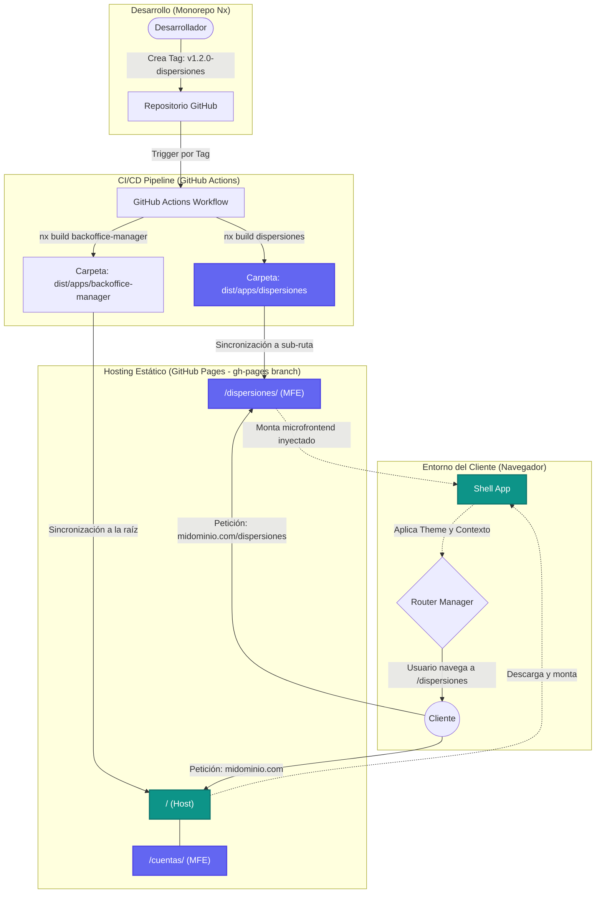

# Arquitectura de Backoffice Multi-Cliente

Esta guía define la arquitectura para la construcción de un Backoffice escalable, orientado a múltiples clientes (YPF y terceros), utilizando **Micro Frontends (MFEs)** independientes para cada feature, gestión unificada de permisos, y **branding dinámico** configurado a través de `tucu-ui`.

---

## 1. Visión General del Sistema

Para soportar clientes con identidades visuales distintas y requerimientos de acceso diferenciados (Feature Flags), implementamos una arquitectura **Path-Based Micro-Frontend** en un monorepo (Nx).

### Componentes Principales

1. **Host App / Shell (`backoffice-manager`)**:
   Actúa como el orquestador global. Su rol es:
   - Manejar la autenticación (Login).
   - Cargar y aplicar las configuraciones del Tenant/Cliente (Branding y Theming).
   - Cargar y proveer los Feature Flags y Permisos de usuario.
   - Renderear el menú lateral unificado (`ThemeProvider`).

2. **Feature MFEs (`dispersiones`, `cuentas`, etc.)**:
   Son aplicaciones independientes encargadas de dominios de negocio concretos.
   - Se construyen y despliegan independientemente.
   - Asumen que la sesión, los estilos y la navegación son orquestados por el Host.
   - Son accesibles mediante rutas separadas, ej: `/dispersiones/`, `/cuentas/`.

3. **Librerías Compartidas (`libs/`)**:
   Para evitar la duplicación de código, el monorepo comparte librerías base:
   - `libs/shell`: Expone el `ShellWrapper` (Componente que agrupa `ThemeProvider` y layouts).
   - `libs/auth-security`: Contiene validaciones JWT, Zustand stores de permisos, y Custom Hooks (ej. `usePermissions`).
   - `libs/api`: Cliente HTTP global, instancias de Axios o React Query pre-configuradas.

---

## 2. Branding y Theming Dinámico (Multi-Cliente)

Dado que `tucu-ui` utiliza un sistema de temas muy avanzado mediante el store global `useTheme`, podemos configurar el Backoffice para que adopte los colores, logotipos y layouts del cliente específico en tiempo de ejecución.

### Flujo de Inicialización de Branding

1. **Login y Obtención de Contexto**: Al autenticarse con el API, el `backoffice-manager` consulta la configuración gráfica del cliente (Tenant ID).
2. **Aplicación Global de Estilos**: Se utilizan los _setters_ de `tucu-ui` expuestos por `useTheme` para forzar las variantes deseadas:

```tsx
import { useTheme } from '@e-burgos/tucu-ui';

const applyClientBranding = (clientConfig) => {
  const { setPrimaryPreset, setLogo, setMode, setLayout } = useTheme.getState();
  
  // 1. Configuramos el logo
  setLogo({ name: clientConfig.name, secondName: 'Backoffice', url: clientConfig.logoUrl });
  
  // 2. Colores de la marca (Primary, Accent, etc.)
  if(clientConfig.colors.primary) {
      setPrimaryPreset({ name: 'brand-primary', color: clientConfig.colors.primary });
  }

  // 3. Forzar variante de interfaz si lo requiere (ej. macos-tahoe)
  if(clientConfig.themeVariant) {
      setLayout(clientConfig.themeVariant);
  }
}
```

3. **Propagación en MFEs**: Debido a que los MFEs consumen el mismo contexto subyacente y los mismos tokens de CSS, todo el ecosistema (botones, formularios de dispersiones, dashboards) mutará visualmente para acomodarse al cliente.

---

## 3. Feature Flags y Control de Acceso

Las *Features* masivas, como **Dispersiones** o **Cuenta Remunerada**, estarán reguladas por la configuración del cliente en el Backend.

### Control a Nivel de Navegación (Host)

La navegación del Host utiliza el atributo `menuItems` de `ThemeProvider`. Se generará dinámicamente según los *Feature Flags* habilitados para el cliente:

```tsx
const useAppMenu = (permissions) => {
  return useMemo(() => {
    const routes = [];
    
    if (permissions.hasFeature('dispersiones')) {
      routes.push({ name: 'Dispersiones', path: '/dispersiones', icon: <LucideIcons.CreditCard />, component: <DispersionesMFE /> });
    }
    
    if (permissions.hasFeature('cuentas')) {
       routes.push({ name: 'Cuentas Remuneradas', path: '/cuentas', icon: <LucideIcons.Wallet />, component: <CuentasMFE /> });
    }
    
    return routes;
  }, [permissions]);
};
```

### Route Guards por MFE

Incluso si el MFE no aparece en el menú, se protegerá su ruta directa mediante verificaciones en el montaje inicial. Cada MFE validará `usePermissions('dispersiones')` al renderizar su bloque central, garantizando seguridad robusta.

---

## 4. Despliegue CI/CD Independiente en GitHub Pages

Dado que la intención es mantener los MFEs separados y usar GitHub Pages (sirviendo bundles estáticos) como capa de hosting, el despliegue funcionará actualizando subcarpetas independientes a partir de **Tags**.

### Estrategia de Sub-rutas (Base Path)

- El **Host (`backoffice-manager`)** será compilado con `base: '/'` y residirá en la raíz.
- El **MFE (`dispersiones`)** será compilado con `base: '/dispersiones/'` y residirá en dicho subdirectorio en GitHub Pages.

### Flujo CI/CD

1. Un desarrollador envía cambios al código de dispersiones y realiza el release creando un tag: `v1.2.0-dispersiones`.
2. **GitHub Actions** se activa interceptando los tags:
   - Identifica el nombre de la feature en el sufijo del tag.
   - Ejecuta: `nx build dispersiones --prod`.
   - Copia el resultado `dist/apps/dispersiones` hacia la rama `gh-pages` en la carpeta `/dispersiones/` (sobrescribiendo únicamente el MFE objetivo y respetando el resto de las apps y el Host).
3. Automáticamente, cuando los usuarios naveguen a `/dispersiones/`, el Host inyectará el módulo estático servido en GitHub Pages de la nueva versión.

Esta estrategia consolida la solidez arquitectónica, permite aislar ciclos de producto (Dispersiones puede fallar sin tumbar Cuentas), simplifica los despliegues e integra profundamente la librería `tucu-ui`.

### Diagrama de Despliegue y Flujo CI/CD

El siguiente diagrama ilustra cómo se estructuran las aplicaciones dentro del monorepo, cómo GitHub Actions intercepta los despliegues por tag y cómo GitHub Pages aloja el contenido estático para ser consumido por el navegador del cliente.


